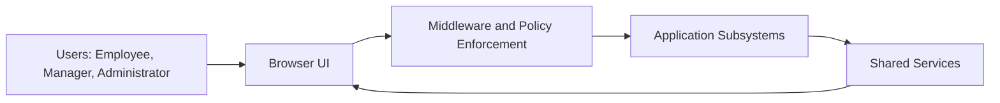
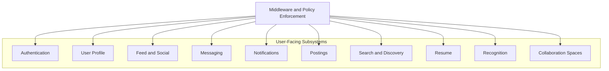
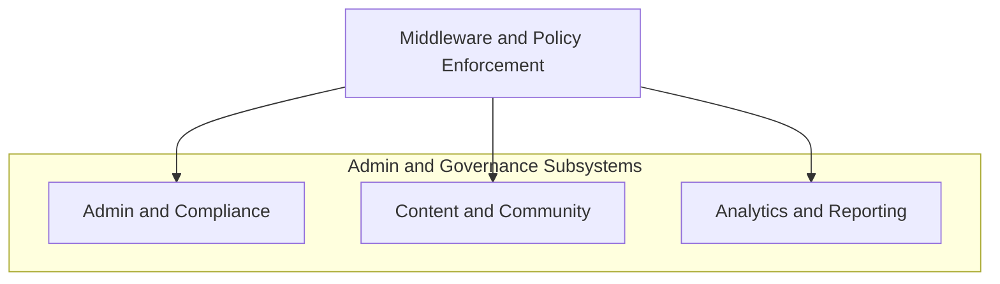
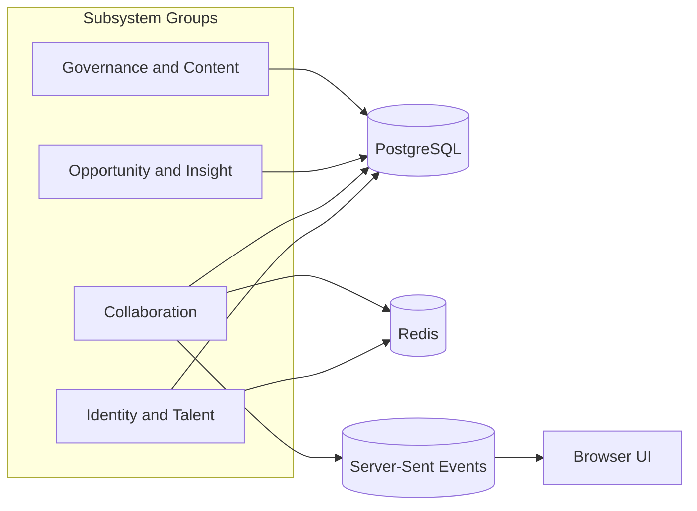

# USDA Talent Marketplace App
## Software Design Document

**Program:** OCIO Special Unit Proposal - Talent Marketplace App  
**Product:** USDA JobPortal / Talent Marketplace App  
**Document Type:** Software Design Document  
**Status:** Draft  
**Last Updated:** 2026-05-28  
**Audience:** OCIO leadership, engineering, QA, operations, security, and program stakeholders  

## 1. Executive Summary

The Talent Marketplace App is planned as a fully functional, production-ready internal platform for discovering, matching, and deploying USDA technical talent. The program is organized within the OCIO Special Unit, with no external partner agencies participating in delivery.

The application is implemented with Go, PostgreSQL, Redis, Docker, USDA design assets, SQL migrations, and automated tests. The codebase already contains a broad set of workforce, collaboration, content, and administrative capabilities. The remaining effort is focused on stabilization, integration, validation, and launch readiness.

The proposal calls for an early August 2026 launch and completion of all development, integration, testing, delivery, and supporting documentation no later than September 5, 2026.

## 2. Purpose

This document defines the current software design for the Talent Marketplace App based on the local proposal document, the repository implementation, the roadmap, the QA plan, and the known-bug backlog. It is intended to describe both the target delivery model and the system as it exists today.

## 3. Program Context

The Talent Marketplace App supports OCIO workforce modernization objectives by providing one internal platform for:

- Professional profiles and resumés
- Detail and project postings
- Applications and outcomes
- Networking, groups, and messaging
- Notifications and activity tracking
- Analytics and workforce insights
- Administrative, moderation, and compliance workflows

The proposal frames the work as a time-bounded Special Unit effort staffed by five FTEs on detail assignments for approximately 90 days. The team is expected to contribute across development, testing, UX, content, administrative support, and operational readiness functions.

## 4. Goals and Objectives

### 4.1 Primary Objective

Deliver a fully integrated, production-ready Talent Marketplace App by the end of August 2026, with all development, refinement, stabilization, and supporting documentation completed no later than September 5, 2026.

### 4.2 Secondary Objectives

- Finalize and integrate the major application features already present in the codebase.
- Ensure consistency across talent-matching, community, communication, analytics, and administrative workflows.
- Align the application with USDA branding, accessibility expectations, security practices, and acceptable-use requirements.
- Deliver a complete administrative and compliance suite for OCIO operators.
- Strengthen maintainability and operational readiness through automated testing, seed data, logging, and containerized deployment.

## 5. Scope

### 5.1 In Scope

The following capabilities are within the delivery scope described by the proposal:

- Platform architecture and backend services
- User management and role-based access control
- Profile management, resumes, skills, accomplishments, and work status
- Detail and project postings, applications, outcomes, search, filters, and history
- Connections, follows, groups, org chart, and workforce discovery
- Messaging, notifications, read states, and conversation history
- Activity feed, hashtags, drafts, scheduled posts, reactions, and shared posts
- News, announcements, articles, kudos, polls, spotlights, and feedback features
- Administrative dashboards, FOIA export, audit logs, reporting, and content oversight
- Moderation workflows and Acceptable Use Policy enforcement
- User interface and front-end alignment with USDA design assets
- Testing, stabilization, seed data, and operational readiness
- Documentation and support artifacts

### 5.2 Out of Scope

The proposal explicitly excludes the following from the current delivery window:

- eAuth integration, deferred until after launch
- Standing up permanent recruiting or staffing functions
- Hosting environment provisioning beyond the Docker-based deployment model
- Future enhancements beyond the defined delivery scope

## 6. Current Implementation Status

The repository shows a mature application rather than a blank-slate build. Major feature areas are already implemented, and current work is focused on polishing, stabilization, and launch readiness.

### 6.1 Implemented Capability Areas

- Authentication and session management
- Role-based authorization for employee, manager, and admin users
- Profile editing, avatar upload, experience, education, and skills
- Endorsements, verifications, and profile completeness indicators
- Feed, comments, reactions, hashtags, mentions, file attachments, and reposting
- Draft posts and scheduled posts
- Connections, follows, search, and directory browsing
- Direct and group messaging with live updates
- Notifications and click-through routing
- Postings, applications, status updates, and closeout
- Resumé upload and resumé generation
- Badges, kudos, employee spotlight, and analytics surfaces
- Admin dashboards, FOIA tooling, moderation, and audit logs
- Project workspaces and supporting collaboration surfaces

### 6.2 Active Stability Gaps

The current bug backlog is concentrated in user experience and workflow consistency. The main problem areas are admin controls, dropdown interactions, feed usability, posting outcomes, and a few notification and content workflows. These do not block the architectural model, but they remain important for launch readiness.

## 7. Stakeholders and Roles

### 7.1 OCIO Special Unit Team

The delivery team consists of detail-assigned contributors working across multiple disciplines rather than in fixed siloed roles. Based on the proposal, the team is expected to cover backend development, testing, UX/design, administrative content support, and operational readiness.

### 7.2 External Partners

No external agencies or USDA components are participating in delivery for this effort.

### 7.3 End Users

- Employees use the app to manage profiles, connect, message, search opportunities, and participate in the feed.
- Managers use the app to create postings, review applicants, and support workforce mobility.
- Administrators use the app to manage users, moderation, compliance, reporting, and operational control.

## 8. Functional Design

### 8.1 Identity and Access Management

The application uses password-based authentication with bcrypt hashing and Redis-backed sessions. Server-side middleware enforces role-based access.

Design characteristics:

- Session state is externalized to Redis.
- Roles include employee, manager, and admin.
- Sensitive routes are protected on the server.
- A seeded admin account supports first-run environments.

### 8.2 Profile and Talent Records

Profiles are the central data object for talent discovery. They include:

- Name, headline, location, and about text
- Avatar
- Experience and education history
- Skills and endorsements
- Skill verifications
- Profile completeness indicators
- Optional work-status and celebration data

### 8.3 Talent Marketplace Workflows

The marketplace portion of the app supports:

- Posting creation and search
- Skill matching
- Application submission and review
- Status changes, closeout, and outcomes
- Applicant history and manager visibility

This is the core business workflow linking employee skill data to USDA staffing and detail needs.

### 8.4 Collaboration and Community

The collaboration layer provides:

- Activity feed and social posts
- Comments, reactions, shares, drafts, and scheduled posts
- Hashtags, mentions, and link previews
- News, announcements, articles, polls, and spotlights
- Group interactions and community engagement

### 8.5 Messaging and Notifications

Messaging supports direct and group conversations, read states, typing indicators, attachments, and pinned contacts. Notifications are used to connect feed, messaging, connection, posting, and moderation actions to user-visible alerts.

### 8.6 Administration, Moderation, and Compliance

Administrative and compliance functions include:

- User management and audit logs
- FOIA search and export
- Moderation queue workflows
- AUP enforcement
- Reporting and leadership dashboards
- Skills gap analysis and workforce analytics

## 9. System Architecture

### 9.1 Technology Stack

- Go for application logic and HTTP handlers
- PostgreSQL for relational data storage
- Redis for sessions and transient state
- Docker and Docker Compose for environment consistency
- Server-side HTML templates and static assets for the UI
- Automated Go, Python, and Playwright testing for quality validation

### 9.2 Application Structure

The repository follows a command-plus-domain-package model:

- `cmd/server` for the application server
- `cmd/seed` for seed data workflows
- `cmd/bots/testserver` for deterministic test fixtures
- `internal/*` for feature-oriented domain logic

This structure keeps the application modular while preserving a simple operational model.

### 9.3 Data Layer

The application relies on PostgreSQL migrations to define and evolve the schema. The design uses a normalized relational model with explicit constraints for identity, postings, conversations, notifications, and other core workflows. Binary content such as avatars and attachments is stored in the database.

### 9.4 Real-Time Design

Server-Sent Events are used for live feed updates, notification badge refresh, and messaging-related signals. This provides near-real-time user feedback without requiring broad polling across the application.

### 9.5 Rendering Model

The application is server-rendered. Domain templates are composed from shared layouts and feature-specific views, enabling consistent USDA branding and relatively simple deployment.

### 9.6 Subsystem Overview

The application is composed of feature-oriented subsystems. Each subsystem owns a specific slice of the user experience, business logic, and data access patterns.

| Subsystem | Responsibility | Representative Code |
|---|---|---|
| Authentication | Registration, login, session creation, logout, and role-aware access control | internal/auth/handler.go, internal/auth/session.go, internal/middleware/ |
| User Profile | Profile editing, avatar handling, completeness, visibility, work status, and profile presentation | internal/user/handler.go, internal/user/model.go |
| Feed | Posts, comments, reactions, hashtags, drafts, shares, previews, and feed assembly | internal/feed/handler.go, internal/feed/linkpreview.go |
| Messaging | Direct/group conversations, message delivery, read status, typing events, and pinned contacts | internal/messaging/handler.go, internal/messaging/broker.go |
| Notifications | Notification creation, unread counts, read/delete actions, and click routing | internal/notification/handler.go, internal/notification/broker.go |
| Postings | Detail/project postings, skill matching, applications, status updates, and closeout | internal/posting/handler.go |
| Resume | Resume upload, listing, download, and printable resume generation | internal/resume/handler.go |
| Recognition | Kudos, badges, and spotlight-related workflows | internal/kudos/, internal/badge/, internal/spotlight/handler.go |
| Search and Discovery | Employee search, directory browsing, and surfaced connection status | internal/search/, internal/orgchart/handler.go |
| Analytics | Workforce dashboards, insight views, and reporting surfaces | internal/analytics/handler.go, internal/insights/ |
| Admin and Compliance | User management, audit logging, moderation, FOIA, and policy enforcement | internal/admin/handler.go, internal/moderation/handler.go, internal/foia/handler.go, internal/aup/handler.go |
| Collaboration Spaces | Project workspaces, notes, membership, and local collaboration state | internal/workspace/handler.go |
| Content | Articles, news, announcements, polls, feedback, and content publishing | internal/article/, internal/news/, internal/announcement/, internal/poll/, internal/feedback/handler.go |

#### 9.6.1 Subsystem Interaction Model

The subsystems are intentionally coupled through a few shared platform services rather than through direct cross-package dependencies:

- PostgreSQL is the shared source of truth for persistent entities.
- Redis is the shared mechanism for sessions and selected real-time or transient state.
- The template layer is shared across the UI, with domain-specific pages composed from common layouts.
- Server-Sent Events provide a common mechanism for refresh and live updates across notifications, feed, and messaging.
- Middleware applies cross-cutting authorization, policy, and request-context behavior.

This structure keeps feature logic separated while allowing the user-facing workflows to feel like one integrated product.

## 10. Execution Plan

The proposal describes a phased delivery model. The current repository state suggests the system is already beyond foundation work and now lives primarily in the integration, stabilization, and launch-preparation phases.

### 10.1 Phase 1 - System Consolidation and Foundation Hardening

Objective: establish a stable and unified baseline.

Activities:

- Consolidate backend services, handlers, templates, and static assets.
- Validate database migrations, Redis integration, and data models.
- Resolve structural inconsistencies and legacy patterns.
- Stabilize local and containerized environments.

### 10.2 Phase 2 - Feature Integration and Workflow Completion

Objective: finalize and connect major functional workflows.

Activities:

- Complete posting, application, resume, profile, and messaging workflows.
- Integrate feed, reactions, groups, kudos, announcements, news, and polls.
- Finalize admin dashboards, moderation, FOIA exports, and audit logs.
- Confirm navigation, workflow consistency, and USDA-branded layouts.

### 10.3 Phase 3 - User Experience, Accessibility, and Design Alignment

Objective: align the app with USDA UX and accessibility expectations.

Activities:

- Apply USDA design system components and typography.
- Improve layout consistency and form usability.
- Validate keyboard access, contrast, semantic structure, and ARIA support.
- Refine onboarding and landing experiences.

### 10.4 Phase 4 - Comprehensive Testing and Stabilization

Objective: achieve stable, reliable platform behavior.

Activities:

- Execute automated test suites across Go and Python layers.
- Run manual functional testing across major modules.
- Validate data flows, caching behavior, and performance.
- Resolve defects through regression cycles.

### 10.5 Phase 5 - Launch Preparation and Deployment Readiness

Objective: prepare for late August launch.

Activities:

- Finalize configuration and container readiness.
- Validate seed data, users, postings, and org structures.
- Complete documentation for users, administrators, and support staff.
- Perform internal dry-runs of critical workflows.

### 10.6 Phase 6 - Launch, Monitoring, and Completion

Objective: launch and close out all remaining obligations.

Activities:

- Launch the platform in late August 2026.
- Monitor logs, defects, and performance.
- Address post-launch fixes and residual integration tasks.
- Close out documentation and operational guidance.
- Complete all work by September 5, 2026.

## 11. Deliverables

### 11.1 Talent Matching and Workforce Mobility

- Completed detail and project posting workflows
- Application and outcome workflows
- Profile, resume, accomplishments, and work-status support
- Search, filters, and application history

### 11.2 User Profiles, Identity, and Engagement

- Profile system with completeness and visibility indicators
- Profile printing and export workflows
- Connections, follows, and mapping
- Onboarding and help surfaces

### 11.3 Messaging, Notifications, and Communication

- Direct and group messaging with read status and attachments
- Real-time notifications and user-configurable settings
- Messaging broker and Redis integration

### 11.4 Community, Content, and Social Features

- News, announcements, articles, and spotlight modules
- Kudos, badges, reactions, polls, and groups
- Feed, hashtags, trending, drafts, scheduled posts, and shares
- Content moderation workflows

### 11.5 Analytics and Reporting

- Skills dashboards, workforce insights, heatmaps, and network views
- Learning and skills gap reporting
- Administrative reporting and exportable structures

### 11.6 Administrative, Moderation, and Compliance Tools

- User management and content review dashboards
- FOIA export tooling and audit visibility
- AUP enforcement workflows
- Moderation queue and admin approval flows

### 11.7 UI/UX, Templates, and Front-End Experience

- USDA-branded templates and navigation
- Static assets aligned to design standards
- Accessibility-validated views for primary workflows

### 11.8 Data, Migrations, and System Architecture

- Validated PostgreSQL schema via SQL migrations
- Redis configuration for sessions and real-time workflows
- Documented data flows and deployment-ready Docker configuration

### 11.9 Testing, Verification, and Launch Readiness

- Go unit and integration test coverage
- Playwright and Python UI test suites
- Regression validation, seed data, and launch configuration

### 11.10 Documentation and Support Materials

- Internal documentation for developers and administrators
- User guidance and onboarding notes
- Post-launch operational reference material

## 12. Non-Functional Requirements

### 12.1 Security

- Strong password hashing
- Server-side authorization
- Environment-based secrets
- File validation for uploads
- Planned eAuth integration after launch

### 12.2 Accessibility

- USDA design system usage
- Section 508 alignment
- Keyboard-friendly workflows
- Contrast and semantic structure validation

### 12.3 Performance and Reliability

- Predictable PostgreSQL access patterns
- Redis-backed transient state
- Real-time updates for core collaboration flows
- Stable containerized deployment

### 12.4 Maintainability

- Feature-oriented package structure
- Automated testing and deterministic fixtures
- Migration-driven data evolution
- Clear operational documentation

## 13. Testing and Quality Strategy

The proposal expects comprehensive validation across backend and UI surfaces. The repository supports that model through:

- Go unit tests and handler tests
- SQL mock-based verification
- Fixture-server workflows
- Python unittest and Playwright UI tests

The current CI posture should continue to enforce `go vet ./...` and `go test -race ./...` for the Go stack, with browser-surface validation for critical user journeys.

## 14. Deployment Model

The proposal’s deployment model is intentionally simple and reproducible:

- Dockerized application runtime
- Docker Compose for local and integration environments
- PostgreSQL and Redis as primary dependencies
- USDA-managed hosting beyond the local Docker model

## 15. Risks and Constraints

### 15.1 Delivery Risks

- Remaining UI/workflow defects may affect launch polish.
- Real-time features rely on browser and network stability.
- Database-backed binary storage may require future scaling review.
- Some administrative flows still need usability improvements.

### 15.2 Program Constraints

- Delivery must remain inside the OCIO Special Unit scope.
- No external agencies are participating.
- eAuth is intentionally deferred until after launch.
- All work must complete by September 5, 2026.

## 16. Success Metrics

Success for this program is measured by delivery readiness and functional completeness rather than adoption numbers.

### 16.1 Platform Functionality

- Core workflows operate without critical defects.
- PostgreSQL, Redis, and Go backend interactions behave consistently.
- User-facing pages render with USDA branding and accessibility in mind.
- Admin, FOIA, and moderation tools function as intended.

### 16.2 Stability and Reliability

- No launch-blocking defects remain open.
- High-severity issues are resolved or mitigated.
- Automated tests and regression passes succeed consistently.
- Docker-based deployment is stable.

### 16.3 Security, Compliance, and Accessibility

- AUP, session handling, and authentication workflows function correctly.
- USDA design and Section 508 expectations are validated.
- Moderation and administrative workflows remain secure and consistent.

### 16.4 Delivery Milestones

- Late August 2026 launch completed on time.
- Documentation and support materials complete before launch.
- Seed data, test accounts, and environment configuration validated.
- All feature groups production-ready by September 5, 2026.

## 17. Current Repository References

- ROADMAP.md
- QA_TEST_PLAN.md
- KNOWN_BUGS.md
- SOFTWARE_DESIGN_DOCUMENT.md

## 18. Acronyms

| Acronym | Meaning |
|---|---|
| AUP | Acceptable Use Policy |
| API | Application Programming Interface |
| ACID | Atomicity, Consistency, Isolation, Durability |
| ARIA | Accessible Rich Internet Applications |
| CI | Continuous Integration |
| DB | Database |
| FTE | Full-Time Equivalent |
| FOIA | Freedom of Information Act |
| OCIO | Office of the Chief Information Officer |
| PDF | Portable Document Format |
| PII | Personally Identifiable Information |
| QA | Quality Assurance |
| RBAC | Role-Based Access Control |
| REST | Representational State Transfer |
| SSE | Server-Sent Events |
| SQL | Structured Query Language |
| UX | User Experience |
| WCAG | Web Content Accessibility Guidelines |
| WSL | Windows Subsystem for Linux |

## 19. Assumptions

The design and delivery plan in this document are based on the following assumptions:

1. The Talent Marketplace App will remain an internal USDA platform and will not expose public-user functionality beyond the landing page and public assets already planned.
2. The OCIO Special Unit remains the sole delivery organization for the current scope.
3. PostgreSQL and Redis remain the primary infrastructure dependencies for the production-ready launch.
4. Docker-based deployment remains the supported packaging model for development, testing, and launch readiness.
5. The current implementation in the repository represents the intended architectural direction, so the remaining work is primarily stabilization and completion rather than major redesign.
6. USDA design assets and branding expectations remain authoritative for the user interface.
7. Accessibility and Section 508 alignment remain launch requirements, even where some remediation is still in progress.
8. eAuth integration is deferred until after launch and is not a blocking dependency for the current release.
9. Automated tests, seed data, and workflow fixtures are available to support regression and launch validation.
10. No external partner agency dependencies are expected to affect the current delivery plan.

## 20. Requirement Traceability Matrix

| Proposal Requirement | Design Coverage | Repository / Evidence |
|---|---|---|
| Production-ready internal talent marketplace | Sections 1, 3, 4, 6, 10, 16 | ROADMAP.md, QA_TEST_PLAN.md |
| Launch by end of August 2026, complete by September 5, 2026 | Sections 1, 4, 10, 16 | Proposal text in `.copilot-artifacts/proposal-extracted.txt` |
| OCIO Special Unit only, no external partners | Sections 3, 7.1, 7.2, 15.2 | Proposal text in `.copilot-artifacts/proposal-extracted.txt` |
| Profiles, resumes, skills, accomplishments, work status | Sections 5.1, 6.1, 8.2, 11.1, 11.2 | Domain packages under `internal/user/`, `internal/resume/` |
| Detail and project postings with applications and outcomes | Sections 5.1, 8.3, 10.2, 11.1 | `internal/posting/`, `migrations/` |
| Connections, groups, org chart, discovery | Sections 5.1, 6.1, 8.4, 11.1 | `internal/connection/`, `internal/group/`, `internal/orgchart/` |
| Messaging, read states, conversation history | Sections 5.1, 8.5, 11.3 | `internal/messaging/`, `cmd/bots/testserver/` |
| Notifications and activity tracking | Sections 5.1, 8.5, 11.3 | `internal/notification/` |
| Feed, hashtags, drafts, scheduled posts, reactions, shared posts | Sections 5.1, 8.4, 11.4 | `internal/feed/`, `internal/posts/` |
| News, announcements, articles, kudos, polls, spotlights | Sections 5.1, 11.4 | `internal/news/`, `internal/announcement/`, `internal/kudos/`, `internal/poll/`, `internal/spotlight/` |
| Administrative dashboards, FOIA export, audit logs | Sections 5.1, 8.6, 11.6 | `internal/admin/`, `internal/foia/` |
| Moderation workflows and AUP enforcement | Sections 5.1, 8.6, 11.6 | `internal/moderation/`, `internal/aup/`, `internal/middleware/` |
| USDA branding and design assets | Sections 5.1, 9.5, 10.3, 11.7 | `templates/`, `static/`, `design_files/` |
| Automated testing and stabilization | Sections 5.1, 11.9, 13 | `cmd/bots/testserver/`, `tests/`, `scripts/run-playwright-tests.sh` |
| Seed data and launch readiness | Sections 10.5, 11.9, 14 | `cmd/seed/`, `scripts/seed.sh` |
| PostgreSQL and Redis architecture | Sections 8.1, 8.3, 8.4, 11.8, 14 | `go.mod`, `docker-compose.yml`, `migrations/` |
| Documentation and support artifacts | Sections 2, 11.10, 17 | `ROADMAP.md`, `QA_TEST_PLAN.md`, `KNOWN_BUGS.md` |

## 21. Subsystem Data Flow

**Figure 1. Subsystem Data Flow (Mermaid)**

### 21.0A Context Flow

### 21.0B User-Facing Routing Flow

### 21.0C Admin and Governance Routing Flow

### 21.0D Data and Real-Time Flow

These diagrams are intentionally split by concern so they remain readable in-document while still representing the same architecture.

### 21.1 Flow Summary

- User actions begin in the browser and enter the application through middleware.
- Middleware applies authentication, authorization, and request-scoped policy before dispatching to feature handlers.
- Feature handlers read and write PostgreSQL for durable business state.
- Redis stores sessions and selected transient state such as conversation or notification support data.
- SSE is used to push live updates back into the browser for the feed, messaging, and notification surfaces.
- Shared templates render a consistent USDA-branded user interface across all subsystems.

## 22. Current Gaps by Subsystem

The open bug backlog is concentrated in a few subsystems rather than across the entire platform. This section maps the remaining gaps to the affected areas so the design document reflects current implementation reality.

| Subsystem | Current Gaps / Open Issues | Evidence |
|---|---|---|
| Admin and Compliance | Dropdown instability, update actions not always persisting, audit summary visibility, missing back-to-dashboard affordance, and inconsistent theming | KNOWN_BUGS.md |
| Feed and Social | Reaction refresh behavior, share/comment layout issues, missing attachment feedback, and comment refresh behavior | KNOWN_BUGS.md |
| Postings | Manager notification gaps, applicant workflow polish, status dropdown behavior, and outcome recording issues | KNOWN_BUGS.md |
| Messaging | The subsystem is implemented and covered by tests, but still depends on real-time and conversation UX consistency across the chat drawer | internal/messaging/, cmd/bots/testserver/main_test.go |
| Notifications | Manager notification gaps and notification flow polish remain open | KNOWN_BUGS.md, internal/notification/ |
| Navigation / Shell | All-tools and messages drawers need better placement and accessibility treatment | KNOWN_BUGS.md, templates/ |
| UX / Accessibility | Keyboard workflows, dropdown behavior, and theming consistency still need refinement | KNOWN_BUGS.md, design_files/ |

These gaps should be interpreted as launch-readiness items, not architecture blockers. The subsystem model is already in place; the remaining work is targeted refinement.

## 23. Subsystem Interface Matrix

This matrix summarizes the main interfaces between the platform subsystems, including the primary inputs they accept, the outputs they produce, the services they depend on, and the code surfaces that currently own the behavior.

| Subsystem | Primary Inputs | Primary Outputs | Dependencies | Representative Code |
|---|---|---|---|---|
| Authentication | Login/register requests, session cookies, logout actions, role context | Session state, authenticated user context, redirects, access decisions | Redis, PostgreSQL, middleware, templates | internal/auth/handler.go, internal/auth/session.go, internal/middleware/ |
| User Profile | Profile edits, avatar uploads, skill/education/experience changes, visibility settings | Updated profile records, completeness indicators, rendered profile pages | PostgreSQL, template system, upload validation | internal/user/handler.go, internal/user/model.go |
| Feed and Social | Post content, comments, reactions, shares, hashtags, attachment uploads, schedule/draft actions | Feed entries, comments, reaction counts, hashtag views, notifications, rendered feed pages | PostgreSQL, SSE, link preview logic, templates | internal/feed/handler.go, internal/feed/linkpreview.go |
| Messaging | Conversation creation, chat messages, member updates, typing/read events, attachment uploads | Conversation state, message history, read receipts, typed events, notification triggers | PostgreSQL, Redis, SSE, browser chat drawer | internal/messaging/handler.go, internal/messaging/broker.go |
| Notifications | Connection, feed, message, and posting events; read/delete actions | Notification badge counts, dropdown lists, routing targets, read status changes | PostgreSQL, Redis, SSE, notification broker | internal/notification/handler.go, internal/notification/broker.go |
| Postings | Posting creation and edits, search/filter queries, application submissions, status updates, close actions | Posting records, applicant lists, matched feed entries, application states, outcomes | PostgreSQL, profile/skills data, templates, middleware | internal/posting/handler.go |
| Resume | Upload, delete, download, and generate actions | Stored resumés, downloadable files, print-friendly resume view | PostgreSQL, templates, file validation | internal/resume/handler.go |
| Recognition | Kudos creation, badge-award triggers, spotlight publication | Badge records, recognition views, spotlight pages | PostgreSQL, profile data, templates | internal/kudos/, internal/badge/, internal/spotlight/handler.go |
| Search and Discovery | Search queries, directory filters, org chart requests | Filtered user results, directory views, org chart views | PostgreSQL, profile data, connection state, templates | internal/search/, internal/orgchart/handler.go |
| Analytics | Dashboard requests, reporting filters, insight views | Workforce analytics pages, skill-gap views, reporting pages | PostgreSQL, templates, aggregate queries | internal/analytics/handler.go, internal/insights/ |
| Admin and Compliance | Role changes, moderation actions, FOIA searches, audit requests, policy operations | Updated roles, exported data, audit entries, moderation decisions, compliance views | PostgreSQL, templates, middleware, policy subsystems | internal/admin/handler.go, internal/moderation/handler.go, internal/foia/handler.go, internal/aup/handler.go |
| Collaboration Spaces | Workspace membership changes, notes, posts, member additions | Workspace state, notes, membership lists, collaboration views | PostgreSQL, templates, user directory data | internal/workspace/handler.go |
| Content | Article/news/announcement/poll/feedback requests and content actions | Published content, request forms, engagement pages, moderation surfaces | PostgreSQL, templates, feed integration where applicable | internal/article/, internal/news/, internal/announcement/, internal/poll/, internal/feedback/handler.go |

### 23.1 Notes on Interfaces

- Most subsystems expose HTTP handlers rather than formal service contracts, so the interface boundary is the route plus request/response shape.
- PostgreSQL is the dominant integration point across all subsystems.
- Redis is used by a smaller set of subsystems for session or transient-state support.
- SSE is used where the UX needs live updates rather than full page reloads.
- Template rendering is the primary presentation boundary between server-side business logic and the browser.

## 24. Interface Contracts

This section defines subsystem-level interface contracts used by the current implementation. The contracts are intentionally defined at route/event shape level because the platform uses handler-based HTTP modules rather than an external API gateway.

### 24.1 External User Interface Contract

- Contract Type: Browser-to-server HTTP requests and server-rendered HTML responses.
- Authentication: Session cookie-based.
- Authorization: Middleware and role checks before protected handlers execute.
- UX Pattern: Post/Redirect/Get for most form workflows.

### 24.2 Handler Contract Standards

- Success path: Render template or redirect to next view.
- Validation errors: Return `400` or render form with guidance.
- Authorization failures: Redirect to login or return `403`.
- Server failures: Log with structured logger and return `500`.

### 24.3 Persistence and Caching Contract

- PostgreSQL contract: All durable business entities are persisted in relational tables via migration-controlled schemas.
- Redis contract: Session state and selected transient/real-time support state.

### 24.4 Real-Time Contract

- Contract Type: SSE channel updates for feed, messaging, and notifications.
- Delivery model: Best-effort near-real-time updates with browser reconnect behavior.
- Fallback behavior: Server-rendered route reloads remain available even if live stream is interrupted.

### 24.5 Subsystem Interface Mapping

For detailed per-subsystem inputs/outputs/dependencies, see Section 23 (Subsystem Interface Matrix).

## 25. Data Architecture

### 25.1 Data Stores

- System of record: PostgreSQL
- Transient/session store: Redis
- Server-rendered template and static-asset layer: filesystem-backed templates and static folders

### 25.2 Relational Data Model Scope

The migration suite indicates a broad normalized data model covering:

- Identity: users, profiles, role attributes
- Talent records: skills, certifications, accomplishments, work status, visibility
- Social graph: connections, follows, groups, bookmarks
- Collaboration: posts, comments, reactions, drafts, scheduled/shared posts, attachments
- Messaging: conversations, direct uniqueness safeguards, message attachments
- Opportunity: postings, applications, outcomes, posting attachments
- Governance/compliance: audit logs, moderation reports, AUP acceptance, FOIA exports
- Organizational views: departments, org chart, workspaces

### 25.3 Data Management Principles

- Schema changes are migration-driven and versioned.
- Referential integrity and uniqueness constraints are used to protect key workflows.
- Binary assets are currently stored in database-backed records where applicable.
- Query behavior is implemented in subsystem handlers and helper modules.

### 25.4 Data Architecture Deliverables

- Logical data model: implemented through migration files in `migrations/`.
- Physical schema controls: implemented through SQL constraints and indexes in migration history.
- Data dictionary: TODO

## 26. Privacy and Records Management

### 26.1 Privacy Scope

The platform processes user profile and workforce collaboration data, including fields that may be considered sensitive workforce information. Privacy handling is currently enforced through authentication, authorization, and route-level visibility controls.

### 26.2 Current Privacy Controls

- Session-based authenticated access for protected routes.
- Role-aware route gating for administrative functions.
- Profile visibility controls indicated by schema and feature coverage.
- FOIA-related retrieval/export workflows under administrative control.

### 26.3 Records Considerations

- Audit-oriented workflows exist for administrative actions.
- FOIA export functionality is implemented and included in admin surfaces.
- Retention and disposition schedule alignment: TODO
- Formal privacy impact assessment references: TODO

### 26.4 Required Follow-on Artifacts

- Data classification matrix by entity: TODO
- Retention policy mapping by table/domain: TODO
- Access-review and least-privilege review cadence: TODO

## 27. Deployment Topology

TODO: Define full deployment topology by environment (development, CI, staging, production), including network boundaries, service placement, ingress, TLS termination points, and configuration management approach.

## 28. Operational Readiness

TODO: Define operational readiness controls, including logging standards, monitoring dashboards, alerting thresholds, incident response runbooks, and on-call ownership model.

## 29. Backup, Recovery, and Continuity

TODO: Define backup schedule, restoration testing cadence, RTO/RPO targets, failover strategy, and continuity procedures for PostgreSQL, Redis, and application runtime services.

## 30. Performance and Capacity Targets

TODO: Define measurable service-level targets (latency, throughput, error budgets), expected user concurrency, scaling approach, and capacity guardrails by subsystem.

## 31. Error Handling and Resilience Patterns

This section is grounded in current source code behavior and identifies practical near-term improvements.

### 31.1 Current Implemented Patterns

- Structured error logging via `slog` is used widely across handlers.
- Validation and permission failures return explicit `400`/`403` responses.
- Unauthenticated requests are redirected to login where required.
- Database initialization uses connection timeout and pool tuning.
- HTTP server uses read/write/idle timeouts.
- Graceful shutdown is implemented with signal handling and bounded shutdown timeout.
- Transaction boundaries are used in selected multi-step workflows.

### 31.2 Current Gaps and Risks

- Error responses are not yet standardized into a shared error envelope.
- Panic recovery behavior is not consistently documented as middleware policy.
- Retry/backoff policies for transient dependency failures are not explicitly standardized.
- Correlation/request IDs are not consistently described in logs and responses.

### 31.3 Reasonable Near-Term Improvements

- Add centralized panic-recovery middleware for consistent `500` handling and crash containment.
- Introduce shared error response helpers for consistent HTTP error semantics.
- Add request ID propagation in middleware and structured logs.
- Define transient-failure retry rules for dependency calls where safe and idempotent.
- Document subsystem-specific timeout defaults and enforce where missing.

## 32. Verification and Acceptance Criteria

The system is considered ready for launch when all categories below are satisfied.

### 32.1 Functional Acceptance

- Core user, posting, messaging, notification, and admin workflows pass regression checks.
- Required role-based restrictions are verified for employee/manager/admin paths.
- FOIA, moderation, and AUP flows execute successfully in test environments.

### 32.2 Quality Acceptance

- `go vet ./...` passes in CI.
- `go test -race ./...` passes in CI.
- Browser workflow tests pass for required surfaces.
- No unresolved launch-blocking defects remain open.

### 32.3 Operational Acceptance

- Environment configuration and seed data are validated.
- Startup, health checks, and graceful shutdown behavior are validated.
- Logging outputs are visible and usable for troubleshooting.

### 32.4 Documentation Acceptance

- SDD sections are complete for launch scope.
- Runbook-level operational notes are available.
- Known limitations and deferred scope are explicitly documented.

## 33. Risks, Mitigations, and Residual Risk Log

| Risk ID | Risk | Mitigation | Residual Risk |
|---|---|---|---|
| R-01 | UI workflow inconsistency in admin and feed surfaces affects usability | Prioritize known-bug backlog by subsystem and complete focused regression cycles | Medium |
| R-02 | Real-time update reliability depends on network/session behavior | Keep server-rendered fallback flows available and validate reconnect behavior | Medium |
| R-03 | Binary asset growth in relational storage impacts DB performance over time | Monitor storage growth and define archive/object-storage transition criteria | Medium |
| R-04 | Incomplete operational runbooks delay incident handling | Produce minimum operational readiness runbook before launch | Medium |
| R-05 | Deferred eAuth integration may create post-launch identity gap | Track eAuth as post-launch program priority with dedicated timeline | Medium |
| R-06 | Inconsistent error handling semantics across handlers | Introduce centralized error helper and recovery middleware | Low-Medium |

## 34. Decision Log and Open Design Questions

### 34.1 Decision Log

| Decision ID | Decision | Status | Notes |
|---|---|---|---|
| D-01 | Use Go stdlib handler/template architecture rather than heavy framework | Accepted | Aligns with current implementation and maintainability goals |
| D-02 | Use PostgreSQL as source of truth and Redis for sessions/transient state | Accepted | Matches current code and deployment model |
| D-03 | Use migration-driven schema evolution | Accepted | Implemented through versioned SQL migrations |
| D-04 | Use SSE for core live-update surfaces | Accepted | Implemented for feed/messaging/notifications |
| D-05 | Defer eAuth integration until after launch | Accepted (Deferred) | Explicitly identified as out-of-scope for current timeline |

### 34.2 Open Design Questions

1. What is the approved production topology and network zoning model for USDA hosting?
2. What are final retention/disposition requirements for social content, messaging data, and audit records?
3. Should binary assets remain in PostgreSQL long term or move to object storage?
4. What SLO/SLA thresholds are required for launch approval?
5. What minimum runbook set is required before handoff to operations?
6. What request ID and observability standards are required across all subsystems?

